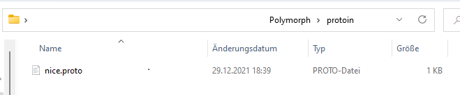
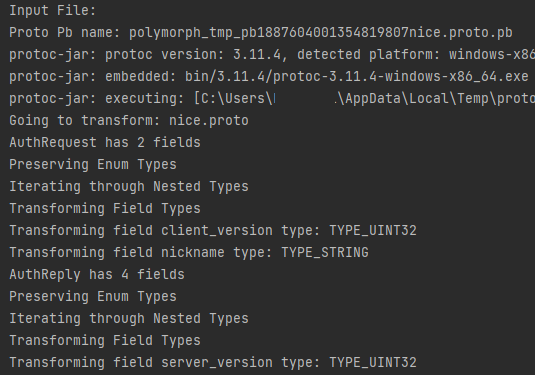
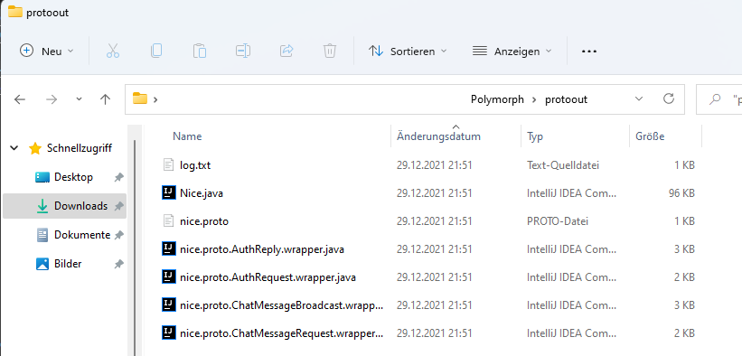
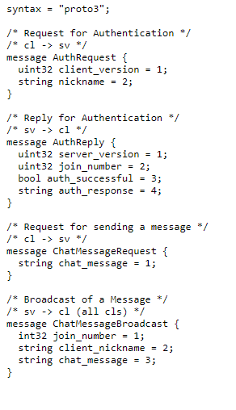
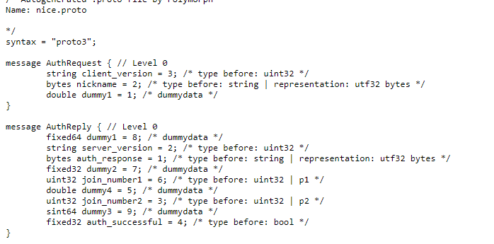

# Polymorphic Protocols
## Explanation
Network Services nowadays are under various threats ranging from ransomware, denial of service using botnets, various exploitation techniques including remote code execution and more.
Any of these may cause a significant dent in a companies IT-Infrastructure and may prevent any part of the business from operating, causing myriads in financial damage around the globe.
To circumvent this, this Polymorph exists. It takes as input a .proto file according to the google protobuf specification including a seed, modifies the specification syntacticly while keeping the semantic the same, and outputs this as a new proto file, java wrapper classes to adhere to this new proto file, and new java classes based on this new proto file. The wrapper methods call the new java classes while pertaining to the original API semantic. The goal for these new classes is to be different enough from the original,
on runs with different seeds, to prevent attackers from reliably attacking the same network service. Thus, we have a new method for developing polymorphic APIs for network services, which may be used alongside traditional techniques such as asymmetric encryption.

## About the Code
The Code takes as input a Protos and for each Proto outputs two Java Classes and a new Proto. The input Proto file is a description of your API. This description gets parsed and transformed in numerous ways, creating a new API which still represents the same information as your old one but with different Syntax. The transformations create new fields, mutate your existing fields, split them up, change their order and more. The output is the new API and files to allow you to access the new API the same way you would access your old API in code. Java Code is generated using JavaPoet. Protos are generated using a self written since no pre-existing solution for Java existed at the time of writing. The main Transformators currently are DummyDataTransformator, FieldTransformator, MessageTransformator and PermutationsTransformator. MessageTransformator calls FieldTransformator. DummyDataTransformator and after that PermutationsTransformator are called after the other Transformations since they work independently of them. Estimates for data sizes are done using the ProtoTypeSizeEstimator which estimates a worst case size estimate for any given primitive datatype according to googles  [Protobuf Datatype Documentation](https://developers.google.com/protocol-buffers/docs/proto3#scalar) and [Protobuf Encoding Information](https://developers.google.com/protocol-buffers/docs/encoding).

## Input/Output
### Input
The Input is your API-Description as one or multiple .proto files (matching the Google Protobuf 3 Specification).
### Output
The Output is a new API which  is different from your API but represents the same information. To keep the interface the same for each Proto a Java Wrapper is generated, in addition to a compiled version of that Proto. Additionally, you get the new API in Proto3 Format as well.

### Input/Output as short "Text-Image"
protoin/1.proto file (Proto3 Spec) ->
protoout/1.java file (Generated by protoc)
protoout/1.proto.MessageName.java (Generated by Polymorph, Wrapper to match the interface of your old API so you don't have to change your code)
protoout/log.txt (Logfile for this Polymorph run including a estimate for the APIs summed data size)

# Showcase

### Setup Input Directory

### Execution

### Output

### Proto Input

### Proto Output

# Running Polymorph
- Copy proto files to protoin directory
- Start using no parameters to obfuscate API with a randomly selected Seed
- Start with "passthrough" as argument to regenerate your API to get information about it such as its size
- Start with "testbench" "10" to automatically obfuscate your API 10 times, each output will be in the /protoout/
- Start with "31313" to use 31313 as inputSeed
- Start with "" "my/custom/outputdirectory" to select a random output Seed and my/custom/outputdirectory as output directory

# Usage
- Delete all the contents of protoin and protoout
- Copy your proto files to the protoin directory
- Run the Polymorph
- Drag and drop everything from protoout to your network service. If you have any pre-existing java files from a previous protoc or polymorph run, replace them
- Patch up the imports and package names to match your project
- Compile your code
- Enjoy your new API

# Directories
- Images: img/
- Java solution: Polymorph/
- Using Polymorph, Input Directory: Polymorph/protoin
- Using Polymorph, Output Directory: Polymorph/protoout
- Using Polymorph, TestBench functionality, Output Directory: Polymorph/protoout/%iteration%
- Basic Wrapper idea (incase someone thinks in code): WrapperIdea.java
- Autogenerated File by Google Protoc like the Polymorph wraps around (incase someone thinks in code): AutogeneratedByProtoc.java

# Compiling
If you wish to compile this yourself:
- Open the solution (Code/Polymorph/) in IntelliJ
- Select Build and Run Project as whatever Target you desire (Main, PassThrough, TestBench)
- Incase gradle is being buggy make sure to rerun the gradle installation process & try to use a good java sdk (i used java 17 by eclipse temurin)

# Credits
- Msc.-Inf August See
- Bsc.-Leon Fritz
- Prof. Dr. Mathias Fischer

